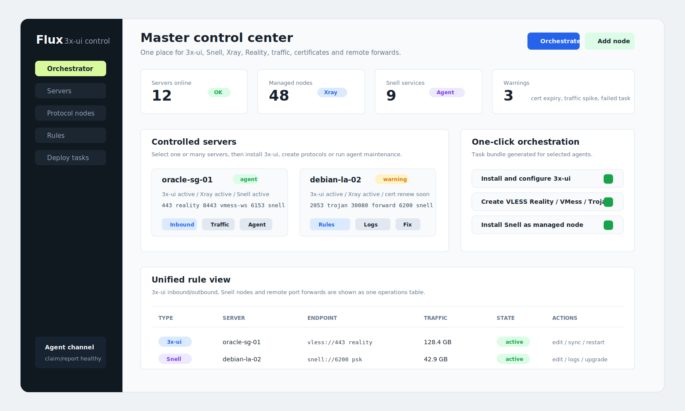

# Flux 3x-ui Orchestrator

[中文说明](README.zh-CN.md)

Flux 3x-ui Orchestrator is an independent master/agent operations panel based on the Flux Panel UI direction and forwarding-panel foundation. It keeps the dense forwarding-control style, then adds multi-server orchestration for 3x-ui, Xray/Reality, Snell, remote port forwarding, certificates, firewall checks, traffic sync and agent maintenance.

Current release: `0.6.0`, a public-trial / release-candidate build. It is suitable for self-hosted testing and small authorized deployments, but it is not a broad `1.0` long-term compatibility promise yet.

Project site:

```text
https://zhizhishu.github.io/flux-3xui-orchestrator/
https://zhizhishu.github.io/
```

## Architecture

The default runtime is a single `flux-master` image:

```text
Browser / controlled agent
        |
        v
flux-master :5166
  - embedded Web UI
  - API
  - task engine
  - state sync
  - Runtime Provider layer
        |
        v
MySQL on the Docker network
```

Runtime Providers are the product boundary between the master task engine and concrete host runtimes:

| Provider | Scope | Executor | Nano hosts |
| --- | --- | --- | --- |
| `xui` | 3x-ui, Xray, Reality, inbounds, outbounds, traffic | master API + agent task | not recommended |
| `snell` | Snell node services | agent task | supported |
| `forward` | TCP/UDP remote forwarding | agent task | supported |
| `certificate` | self-signed, ACME and certificate diagnostics | agent task | task-dependent |
| `firewall` | firewall diagnostics and runtime port handling | agent task | supported |

Snell is unified at the product/node-management layer, but it is not a native Xray or 3x-ui core protocol. The controlled agent deploys Snell as an independent service on the target host.

Runtime Provider metadata now follows the task from master claim to agent report. The agent logs the provider it executes, reports it inside `resultJson.runtimeProvider`, and the master attaches the same audit metadata when an older agent omits it.

Task results also include a normalized `resultJson.runtimeState` block. It records `providerKey`, `providerName`, `protocol`, `action`, `taskState`, resolved `status`, `statusSource`, `updatedAt`, and optional summaries for service states, protocol nodes, forwarding rules, certificates and diagnostics. The control-center task card renders this block so XUI, Snell, forwarding, certificate and firewall tasks share one status model.

State Sync now lifts those task-level runtime states into a server-by-provider overview. The master exposes `/api/v1/deploy-task/runtime-state/overview`, aggregating latest task results with server heartbeat fields for XUI/Xray, Snell and certificates, and the control center renders the same view as a Flux-style operations panel.

The same State Sync rows can also start Runtime Provider maintenance tasks. Operators can launch provider-aware diagnostics from the overview, and XUI/Snell rows expose repair actions that create normal `agent-maintenance` deployment tasks for the controlled agent to claim, execute and report.

Remote log collection also uses the same `agent-maintenance` path. A `logs` action returns structured `logs.items` for the Flux agent runner, x-ui/Xray services, Snell node services, forwarding/task logs and related service managers, and the control-center task card renders a compact remote-log summary before operators open raw output.

## UI Preview



The UI keeps the Flux Panel direction: dense server cards, grouped operations, compact status chips and a unified rule view. It is an operations console, not a marketing page.

Current UI coverage includes:

- server registry, tokens, heartbeats and status cards
- 3x-ui / Xray inbound, outbound, config, traffic and restart actions
- Snell node create/restart/remove flows
- remote TCP/UDP forward rules
- Runtime Provider visibility
- State Sync runtime overview by server and provider
- State Sync runtime diagnostics and repair task shortcuts
- agent diagnostics, logs, restart, upgrade, uninstall and repair tasks
- remote log summaries on agent-maintenance task cards
- monitor alerts and a unified rule center
- `zh-CN` / `en-US` language switching

## Default Ports

The master exposes one public entry by default:

| Port | Purpose | Published by default |
| --- | --- | --- |
| `5166/tcp` | Master Web UI, API and controlled-agent callback | yes |
| `6365/tcp` | backend debug alias | no, only with `FLUX_EXPOSE_BACKEND=1` |
| `3306/tcp` | MySQL | no, Docker network only |
| phpMyAdmin | temporary maintenance | no, only with `FLUX_PHPMYADMIN_PORT` |

Controlled agents do not need an inbound management port. They call the same master URL users open in the browser, for example:

```text
http://MASTER_IP:5166
```

Controlled hosts expose only the business ports you choose: optional 3x-ui panel port `5168`, Xray/Reality inbound ports, Snell listen ports, remote-forward listen ports and ACME HTTP `80/tcp` when selected.

## Quick Start

Install the master:

```bash
curl -fsSL https://raw.githubusercontent.com/zhizhishu/flux-3xui-orchestrator/main/scripts/install-master.sh | sudo bash
```

Alpine or minimal images without `bash`:

```bash
curl -fsSL https://raw.githubusercontent.com/zhizhishu/flux-3xui-orchestrator/main/scripts/install-master-bootstrap.sh | sudo sh
```

Run a non-destructive preflight before installing on a live host:

```bash
curl -fsSL https://raw.githubusercontent.com/zhizhishu/flux-3xui-orchestrator/main/scripts/install-master.sh \
  | sudo bash -s -- doctor
```

Common install overrides:

```bash
curl -fsSL https://raw.githubusercontent.com/zhizhishu/flux-3xui-orchestrator/main/scripts/install-master.sh \
  | sudo env FLUX_FRONTEND_PORT="5166" FLUX_NETWORK_STACK="v4" bash
```

Day-2 operations:

```bash
sudo bash /opt/flux-3xui-orchestrator/install-master.sh upgrade
sudo bash /opt/flux-3xui-orchestrator/install-master.sh backup
sudo bash /opt/flux-3xui-orchestrator/install-master.sh restore --backup-file /opt/flux-3xui-orchestrator/backups/flux-master-backup-YYYYMMDD-HHMMSS.tar.gz
sudo bash /opt/flux-3xui-orchestrator/install-master.sh uninstall --yes
```

## Controlled Agent Install

Create a server in the master control center, then use the server card `Token` action to get `FLUX_SERVER_ID` and `FLUX_AGENT_TOKEN`.

Install the controlled agent on that host:

```bash
curl -fsSL https://raw.githubusercontent.com/zhizhishu/flux-3xui-orchestrator/main/scripts/install-flux-agent.sh \
  | sudo env FLUX_PANEL_URL="http://MASTER_IP:5166" FLUX_SERVER_ID="1" FLUX_AGENT_TOKEN="paste-agent-token-here" bash
```

Alpine or minimal images:

```bash
curl -fsSL https://raw.githubusercontent.com/zhizhishu/flux-3xui-orchestrator/main/scripts/install-flux-agent-bootstrap.sh \
  | sudo env FLUX_PANEL_URL="http://MASTER_IP:5166" FLUX_SERVER_ID="1" FLUX_AGENT_TOKEN="paste-agent-token-here" sh
```

Preflight:

```bash
curl -fsSL https://raw.githubusercontent.com/zhizhishu/flux-3xui-orchestrator/main/scripts/install-flux-agent.sh \
  | sudo env FLUX_PANEL_URL="http://MASTER_IP:5166" FLUX_SERVER_ID="1" FLUX_AGENT_TOKEN="paste-agent-token-here" bash -s -- doctor
```

The agent runs through systemd or OpenRC, claims tasks from the master, executes them locally and reports results back.
Claimed tasks include their Runtime Provider assignment, so task history can be audited by `xui`, `snell`, `forward`, `certificate` or `firewall`.

## Operator Flow

1. Install the master and open `http://MASTER_IP:5166`.
2. Log in and open the master control center.
3. Register each controlled server.
4. Install the agent with the generated token command.
5. Wait for heartbeat.
6. Select one or more servers and run orchestration:
   - install or reuse 3x-ui
   - create VLESS Reality, VMess WebSocket, Trojan TLS or Shadowsocks nodes
   - deploy Snell nodes
   - issue or bind certificates
   - sync rules and traffic
7. Use server cards for inbound/outbound, Snell, forwarding, certificate, firewall and agent maintenance work.

## Low-Memory Hosts

Agent heartbeat reports total memory. The master classifies tiny hosts:

| Profile | Memory | Policy |
| --- | --- | --- |
| `nano-critical` | `< 200 MB` | blocks full 3x-ui / Xray orchestration; use Snell or forwarding |
| `nano` | `< 256 MB` | shows warning; avoid heavy runtimes |
| `small` | `< 512 MB` | consider swap before complex nodes |
| `standard` | `>= 512 MB` | normal path |

## Linux Support

| Target | Debian / Ubuntu | Rocky / Oracle Linux | Alpine / OpenRC |
| --- | --- | --- | --- |
| Master Docker stack | supported | supported | supported with bootstrap |
| Agent service | systemd | systemd | OpenRC |
| Snell node tasks | systemd | systemd | OpenRC |
| Remote forwarding tasks | systemd + `socat` | systemd + `socat` | OpenRC + `socat` |
| Full 3x-ui install/configure | supported | supported | not supported in `0.6.0` |

## Docker And GHCR

Default master image:

```text
ghcr.io/zhizhishu/flux-3xui-orchestrator-master:latest
```

Legacy split images remain for rollback/debug:

```text
ghcr.io/zhizhishu/flux-3xui-orchestrator-backend:latest
ghcr.io/zhizhishu/flux-3xui-orchestrator-frontend:latest
```

`main` and `v*` tags publish GHCR images. The `future` branch builds images for validation, but does not overwrite release images.

## API Summary

Runtime Provider:

```text
POST /api/v1/runtime-provider/list
POST /api/v1/runtime-provider/resolve
```

Core task flow:

```text
POST /api/v1/control-server/create
POST /api/v1/control-server/list
POST /api/v1/control-server/token
POST /api/v1/control-server/heartbeat
POST /api/v1/deploy-task/create
POST /api/v1/deploy-task/orchestrate
POST /api/v1/deploy-task/list
POST /api/v1/deploy-task/retry
POST /api/v1/agent-task/claim
POST /api/v1/agent-task/report
```

Agent reports store both `resultJson.runtimeProvider` and `resultJson.runtimeState`, so task history can be audited by runtime owner and by resolved service/node/diagnostic status.
`agent-maintenance` log reports additionally store structured `logs.items`, covering Flux agent, x-ui/Xray, Snell, forwarding and task-log sources for task-card summaries.

Profiles, nodes, forwarding and 3x-ui:

```text
POST /api/v1/protocol-profile/create
POST /api/v1/protocol-profile/list
POST /api/v1/protocol-profile/update
POST /api/v1/protocol-profile/delete
POST /api/v1/protocol-profile/ensure-defaults
POST /api/v1/protocol-node/create
POST /api/v1/protocol-node/list
POST /api/v1/protocol-node/sync
POST /api/v1/server-forward/create
POST /api/v1/server-forward/list
POST /api/v1/server-rule/overview
POST /api/v1/three-xui/inbounds/list
POST /api/v1/three-xui/outbounds
POST /api/v1/three-xui/traffic/sync
POST /api/v1/three-xui/restart-xray
```

## Verification

Full release gate:

```bash
bash scripts/release-check.sh --full
```

Backend with Docker Maven:

```bash
docker run --rm -v "$PWD/springboot-backend:/workspace" -w /workspace maven:3.9-eclipse-temurin-21 mvn -B -DskipTests package
```

Frontend:

```bash
cd vite-frontend
npm install --legacy-peer-deps
npm run build
```

Common smoke checks:

```bash
bash scripts/test-flux-agent-mock.sh
bash scripts/test-three-xui-fixture.sh
bash scripts/test-compose-smoke.sh --build-local --dry-run
bash scripts/test-compose-smoke.sh --build-local
```

## Remaining Work Before 1.0

- Real VPS matrix: Debian, Ubuntu, Rocky Linux, Oracle Linux and Alpine.
- Real 3x-ui container or VPS end-to-end smoke.
- Better certificate, firewall and cloud-security-group diagnostics.
- RBAC, audit logs, agent token expiry/revocation and key-rotation migration.
- Mobile layout, loading/error states and task-detail polish.

## References And Acknowledgements

This is an independent project, not an official release of the projects below. It deliberately studies and builds on ideas from:

- [Flux Panel](https://github.com/zhizhishu/flux-panel): UI style, forwarding-panel foundation and original operational surface.
- [3x-ui](https://github.com/MHSanaei/3x-ui): Xray/3x-ui protocol-management model and remote panel API behavior.
- [snell.sh](https://github.com/jinqians/snell.sh): Snell installation flow and deployment-script behavior.
- [Komari Monitor](https://github.com/komari-monitor/komari): master/agent monitoring and multi-server operations ideas.

## Safety Notice

Use this project only on infrastructure you own or are authorized to administer. Do not use it for unauthorized access, abuse, evasion, illegal activity or violations of service terms.
