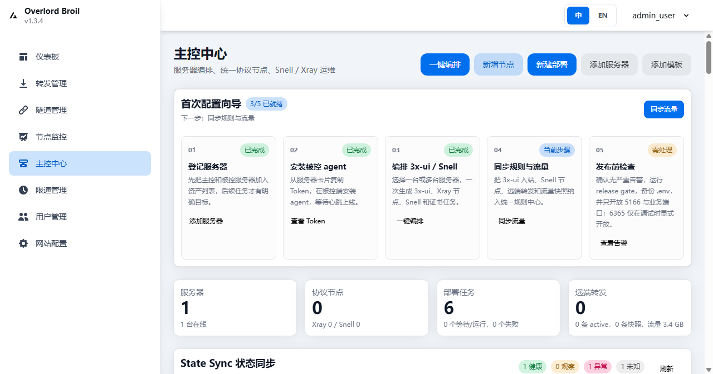
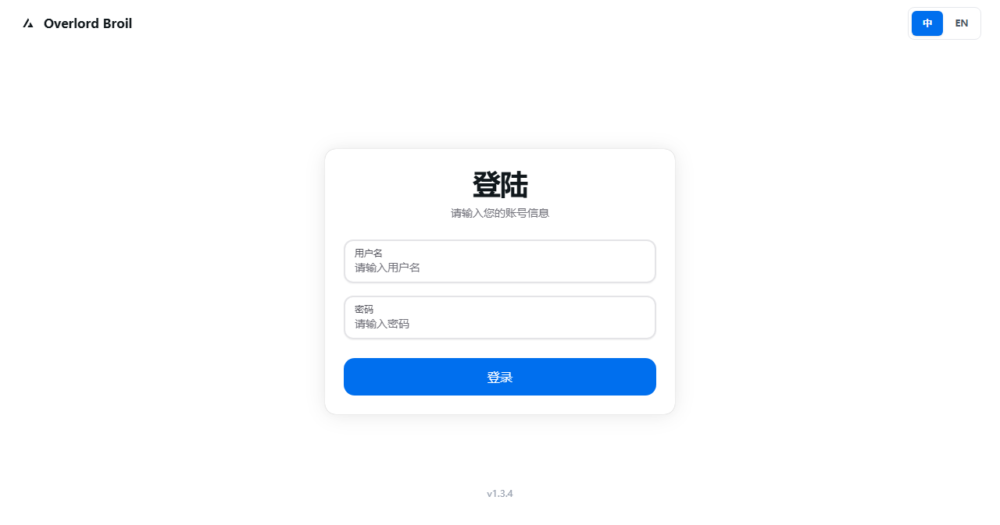

# Overlord Broil 中文说明

[English README](README.md)

Overlord Broil 是一个独立的主控 / 被控运维面板, 用来统一管理多服务器上的 3x-ui / Xray / Reality, Snell, 端口转发, 证书, 防火墙, 流量同步和 Agent 任务.

当前版本定位为 `0.6.0` 公开试用 / 正式候选. 它适合自用, 小规模授权服务器和公开展示, 但还不是承诺长期兼容的 `1.0` 商业级稳定版.

项目站点:

- https://zhizhishu.github.io/overlord-broil/
- https://zhizhishu.github.io/

## 核心架构

默认运行形态是 `overlord-master` 单体主控镜像:

```text
用户浏览器 / 被控 Agent
        |
        v
overlord-master :5166
  - 内置 Web UI
  - API
  - 任务引擎
  - 状态同步
  - Runtime Provider 层
        |
        v
MySQL Docker 内网
或可选 SQLite 本地文件
```

Runtime Provider 层把不同运行时统一到同一套任务和 UI 模型:

| Provider | 管理内容 |
| --- | --- |
| xui | 3x-ui, Xray, Reality, inbound/outbound, 流量同步, Xray restart |
| snell | Snell 服务, PSK, 端口, systemd/OpenRC 生命周期 |
| forward | 远端端口转发, socat, 服务状态, 规则流量 |
| certificate | ACME / 自签证书, 证书文件, 过期时间, 诊断 |
| firewall | 本机防火墙端口放行 / 关闭, 诊断结果 |

Snell 已统一到产品层的“协议节点”管理里, 但它不是 Xray 或 3x-ui 的原生协议. 底层仍由 Agent 在被控服务器上部署独立 Snell 服务, 这样更符合 Snell 的真实运行方式.

## UI Preview



Live screenshots were captured from the `isrco-hk` validation master after redeploying `ghcr.io/zhizhishu/overlord-broil:latest` in SQLite single-container mode.



UI 方向是高信息密度的运维控制台: 服务器卡片, 操作分组, 状态 chip, 统一规则视图, Runtime State, 任务审计和中英文切换.

## 默认端口

| 角色 | 默认端口 | 说明 |
| --- | --- | --- |
| 主控 Web / API | `5166/tcp` | 浏览器和被控 Agent 都访问这一个入口 |
| 主控后端调试别名 | 默认不暴露 | 只有设置 `OB_EXPOSE_BACKEND=1` 才临时暴露 |
| phpMyAdmin | 默认不暴露 | 只有设置 `OB_PHPMYADMIN_PORT` 才临时暴露 |
| MySQL | 不暴露宿主机端口 | 只在 Docker 内网使用 |
| 被控 Agent | 不暴露管理端口 | Agent 主动轮询主控 |

被控服务器只需要根据你创建的业务节点开放实际协议端口, 例如 3x-ui 面板建议 `5168`, Xray inbound 端口, Snell 端口和远端转发端口.

安装或升级时, 脚本会清理旧分离栈容器和临时 phpMyAdmin, 避免旧的 `80/6365/8066` 公网映射残留. 如果选择 SQLite 模式, 还会停止旧的 `gost-mysql` 容器, 但保留 Docker volume 和旧安装文件, 方便手动恢复.

## 安装主控

默认 MySQL 模式:

```bash
curl -fsSL https://raw.githubusercontent.com/zhizhishu/overlord-broil/main/scripts/install-master.sh | sudo bash
```

轻量 SQLite 模式, 不启动 MySQL sidecar:

```bash
curl -fsSL https://raw.githubusercontent.com/zhizhishu/overlord-broil/main/scripts/install-master.sh \
  | sudo env OB_DB_MODE="sqlite" OB_FRONTEND_PORT="5166" bash
```

安装前预检:

```bash
curl -fsSL https://raw.githubusercontent.com/zhizhishu/overlord-broil/main/scripts/install-master.sh \
  | sudo bash -s -- doctor
```

升级:

```bash
sudo /opt/overlord-broil/install-master.sh upgrade
```

默认登录:

```text
username: admin_user
password: admin_user
```

首次登录后请立即修改默认密码, 并备份 `/opt/overlord-broil/.env`.

## 安装被控 Agent

先在主控的“主控中心”创建服务器, 获取 `OB_SERVER_ID` 和 `OB_AGENT_TOKEN`, 然后在被控服务器执行:

```bash
curl -fsSL https://raw.githubusercontent.com/zhizhishu/overlord-broil/main/scripts/install-agent.sh \
  | sudo env OB_PANEL_URL="http://MASTER_IP:5166" OB_SERVER_ID="1" OB_AGENT_TOKEN="paste-agent-token-here" bash
```

Alpine 或极简系统可用 bootstrap:

```sh
wget -O- https://raw.githubusercontent.com/zhizhishu/overlord-broil/main/scripts/install-agent-bootstrap.sh \
  | env OB_PANEL_URL="http://MASTER_IP:5166" OB_SERVER_ID="1" OB_AGENT_TOKEN="paste-agent-token-here" sh
```

Agent 安装后会通过 systemd 或 OpenRC 常驻运行, 主动向主控拉取任务, 在本机执行, 再回报结果. 它不需要开放入站管理端口.

## 使用流程

1. 安装主控, 打开 `http://MASTER_IP:5166`.
2. 登录后台, 进入“主控中心”.
3. 创建服务器, 复制 Agent 安装命令.
4. 在被控服务器安装 Agent, 等待心跳在线.
5. 多选服务器, 执行一键编排: 安装或复用 3x-ui, 创建 Xray/Reality 节点, 部署 Snell, 配置转发, 同步状态.
6. 在统一节点, 转发规则, Runtime State, 任务审计和流量面板里查看结果.

## 低内存服务器

| 档位 | 内存 | 策略 |
| --- | --- | --- |
| nano-critical | `< 200 MB` | 阻止完整 3x-ui / Xray 编排, 建议只跑 Snell 或端口转发 |
| nano | `< 256 MB` | 显示 Nano 提醒, 谨慎创建重运行时任务 |
| small | `< 512 MB` | 显示小内存提醒 |
| standard | `>= 512 MB` | 正常路径 |

这只是保护层, 不保证 3x-ui/Xray 能在超小机器长期稳定运行.

## Linux 支持

| 目标 | Debian / Ubuntu | Rocky / Oracle Linux | Alpine / OpenRC |
| --- | --- | --- | --- |
| 主控 Docker stack | 支持 | 支持 | bootstrap 支持 |
| Agent 服务 | systemd | systemd | OpenRC |
| Snell 节点任务 | systemd | systemd | OpenRC |
| 远端转发任务 | systemd + socat | systemd + socat | OpenRC + socat |
| 完整 3x-ui 安装配置 | 支持 | 支持 | `0.6.0` 暂不支持 |

## Docker 和 GHCR

默认主控镜像:

```text
ghcr.io/zhizhishu/overlord-broil:latest
```

旧的前后端分离运行镜像已从正式产品面移除. 仓库仍保留后端和前端源码模块用于单体构建与本地验证, 但部署和发布只使用 `overlord-master` 单体镜像.

## 本地验证

```bash
bash scripts/test-agent-mock.sh
bash scripts/test-three-xui-fixture.sh
bash scripts/test-snell-real-smoke.sh
bash scripts/test-three-xui-e2e.sh
bash scripts/test-compose-smoke.sh --build-local --dry-run
bash scripts/test-compose-smoke.sh --compose-file docker-compose.sqlite.yml --build-local --dry-run
```

真实 3x-ui 合同烟测是可选项; 没有配置真实地址和 API token 时会自动跳过.

真实验证记录: `isrco-hk` 上的 `ghcr.io/mhsanaei/3x-ui:latest` (`3x-ui 3.1.0`) 已通过直连 3x-ui E2E 写入合同, 也通过 Overlord 主控 API 的 inbound 新增 / 启停 / 删除链路. 临时端口 `42123` 和 `42124` 已清理.

Snell 真机 smoke 会登录主控, 创建临时 Snell 协议节点, 触发被控 Agent 执行, 验证服务和端口, 然后默认删除测试节点. 删除阶段也会确认服务已停止, 监听端口已关闭, 协议节点不再处于 active 状态:

```bash
OB_MASTER_URL="http://127.0.0.1:5166" OB_SNELL_PORT=18390 bash scripts/test-snell-real-smoke.sh
```

## 仍未到 1.0 的部分

- 还需要真实 VPS 矩阵: Debian, Ubuntu, Rocky, Oracle Linux, Alpine.
- 还需要把当前 `isrco-hk` 真实 3x-ui 容器验证扩展到更多 VPS / 云厂商目标.
- 证书, 防火墙和云安全组诊断还可以继续加强.
- RBAC, 审计导出, Agent token 过期 / 吊销, 密钥轮换迁移仍是后续工作.
- 移动端, 加载态, 失败态和任务详情还可以继续打磨.

## 致谢

本项目是独立项目, 不是下列项目的官方发行版, 但参考并感谢它们:

- [Flux Panel](https://github.com/zhizhishu/flux-panel): UI 风格, 转发面板基础和项目结构参考.
- [3x-ui](https://github.com/MHSanaei/3x-ui): Xray / 3x-ui 协议管理模型和远端面板 API 行为参考.
- [snell.sh](https://github.com/jinqians/snell.sh): Snell 安装流程和部署脚本行为参考.
- [Komari Monitor](https://github.com/komari-monitor/komari): 主控 / Agent 监控和多服务器运维思路参考.

## 安全说明

只在你拥有授权的服务器上使用本项目. 请修改默认密码, 保管好 `/opt/overlord-broil/.env`, 不要把 `SECRET_ENCRYPTION_KEY`, Agent token, 3x-ui API token 或 Cookie 公开到日志, Issue, 截图或聊天记录里.
